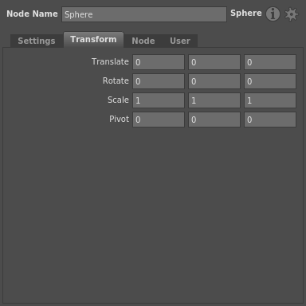

# Compound Plugs #

The same way that nodes can have child plugs, plugs themselves can have children. These types of plugs are called **compound plugs**, and they are built and referenced using the same dictionary syntax.

Compound plugs are often  uses nested plugs in this way to represent list values, such as the common Translate, Rotate, and Scale plugs. You can either set the value of each list item's individual elements, or set them all at once using a special type, such as V3f or V2i.

## See Also ##

- 

<!-- TODO: - [Type Reference]() -->
