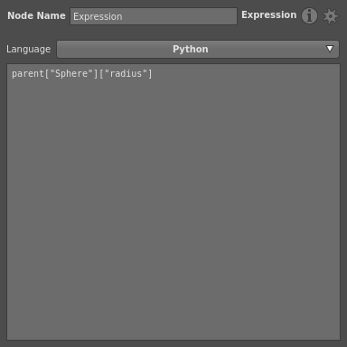
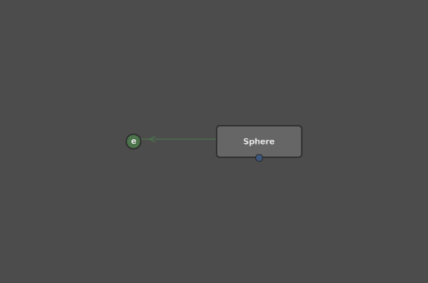
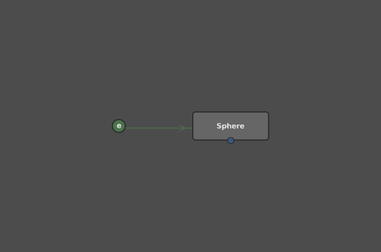

# Expression Node #

The Expression node is a scripting node for executing arbitrary Python or OSL code when the main script is dispatched.

It is one of the few nodes that does not appear as a box in the _Graph Editor_: instead, it appears as a small circle with the label _e_, which cannot be changed. 

You can select either Python or OSL from the node's _Language_ drop-down menu in the _Node Editor_.

> Caution :
> Selecting a different language will erase any code in the input field.

When writing code for Expression nodes, use the `parent` variable to refer to the main script rather than the default `script` variable. For example, you would reference a Sphere's Radius plug with `parent["Sphere"]["radius"]`.

## Expression Connections ##

When an Expression node references or modifies another node's plug, a special green connection with an arrow appears between them in the _Graph Editor_. When the Expression node merely references the node's plug, the arrow points at the Expression node.

When the Expression node modifies the plug's value, the arrow points at the other node.

## See Also ##

- 
