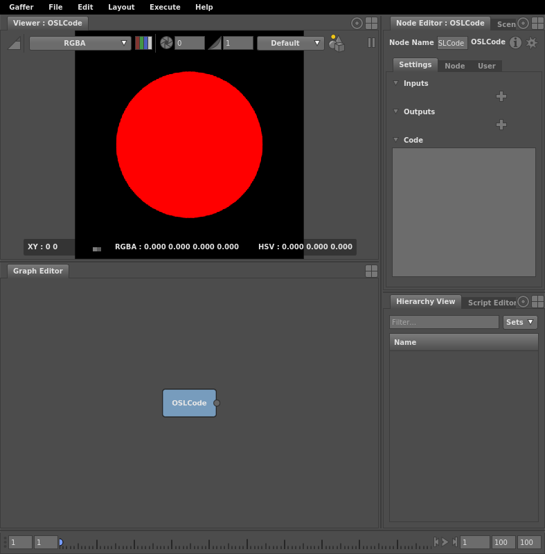

# OSLCode Node #

The [GafferOSL module](../../Reference/NodeReference/GafferOSL/index.md)) provides nodes for creating networks of predefined [OSL](https://github.com/imageworks/OpenShadingLanguage) shaders, to be used in rendering and image and geometry processing without any coding required. Sometimes, however, the shader you need does not exist, or it would be easier to express your ideas through a few lines of code. For these situations, the OSLCode node is needed. It allows OSL source code to be entered directly into the node graph to create new shaders on the fly.

The OSLCode node's plugs are split into three sections:

- _Inputs_: The input parameter plugs. Plug types include a variety of number and vectors.
- _Outputs_: The output parameter plugs. Plug types are the same as the input plugs.
- _Code_: The OSL code to process, using the input and output parameters.

## Input and Output Parameter Plugs ##

You can add any number of input or output parameter plugs. To reference a plug from the Inputs or Outputs sections in your OSL code, drag and drop its label onto the Code input field. This is key to referring to the Color Spline input, which uses a special syntax.

### Matrix plugs ###

The matrix plug type has itself a child plug containing Python or OSL code. To create a matrix and set its value:

1. Add a a matrix plug. The plug value will show as _None_.

2. Right-click on the plug value. A drop-down menu will appear.

3. Select _Create Python Expression..._ or _Create OSL Expression..._.

4. A _Node Editor_ window containing an input field will open. It will contain preset code in the language you specified declaring an empty matrix.

5. Edit the matrix's list values.

## OSL Resources ##

The following resources provide useful information for using OSL:

- [OSL language specification](https://github.com/imageworks/OpenShadingLanguage/blob/master/src/doc/osl-languagespec.pdf)
    - Also available from the Gaffer menu: _Help_ > _Open Shading Language_ > _Language Reference_
- [OSL mailing list](https://groups.google.com/forum/#!forum/osl-dev)

## See Also ##

- [Tutorial: Using the OSLCode Node](../UsingOSLCodeNode/index.md)
- [GafferOSL Module Node Reference](../../Reference/NodeReference/GafferOSL/index.md)
